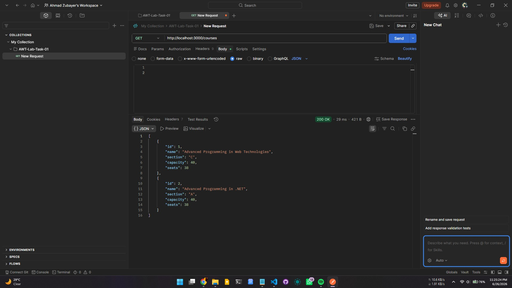
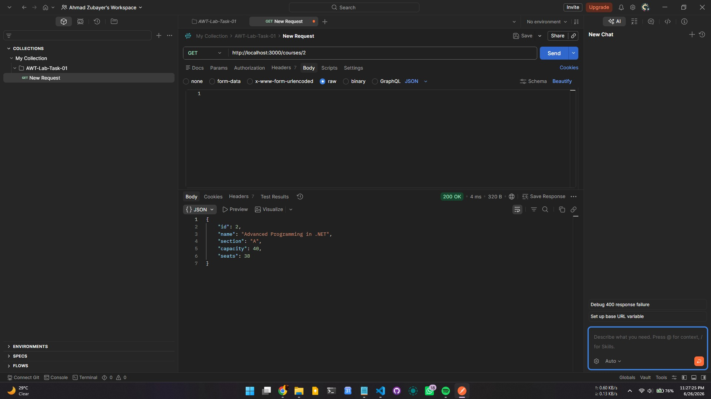
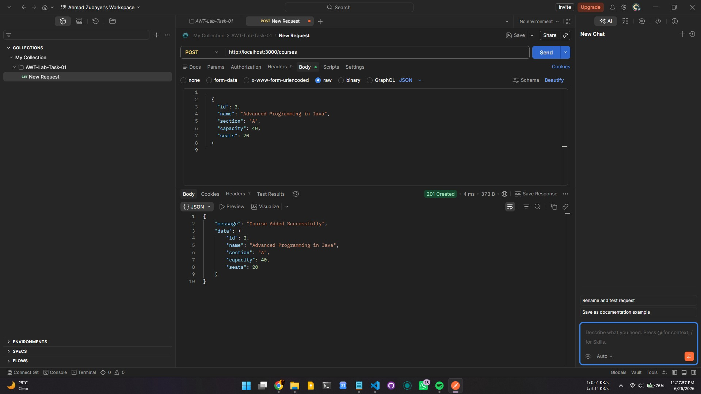
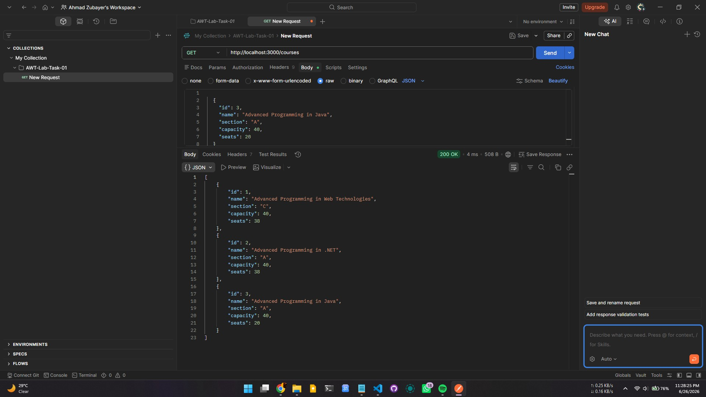
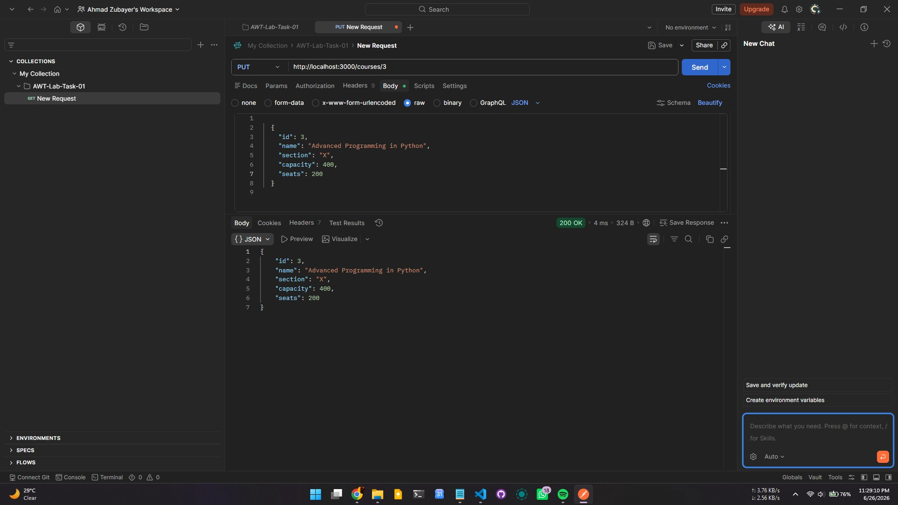
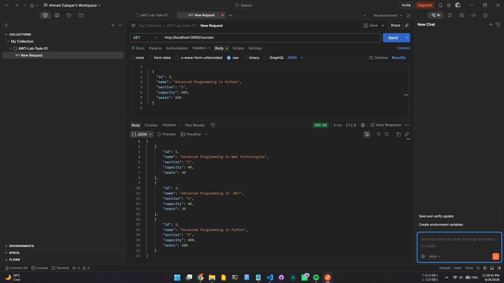
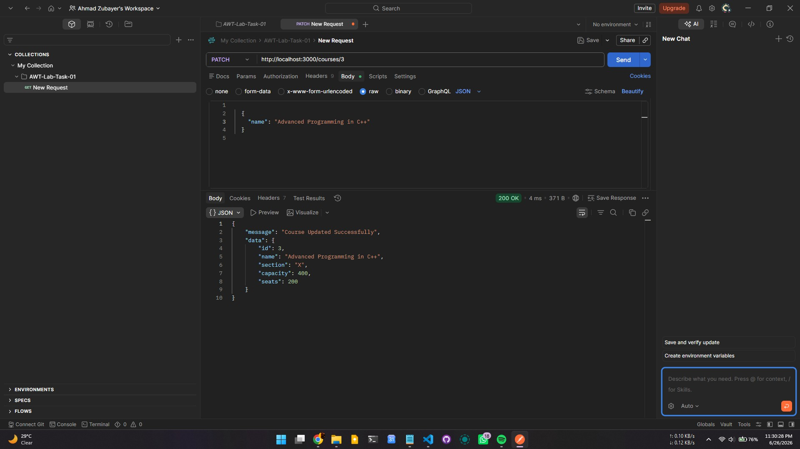
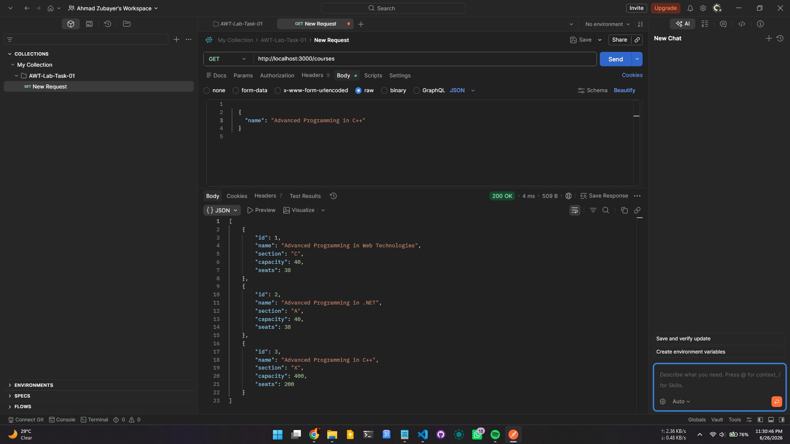
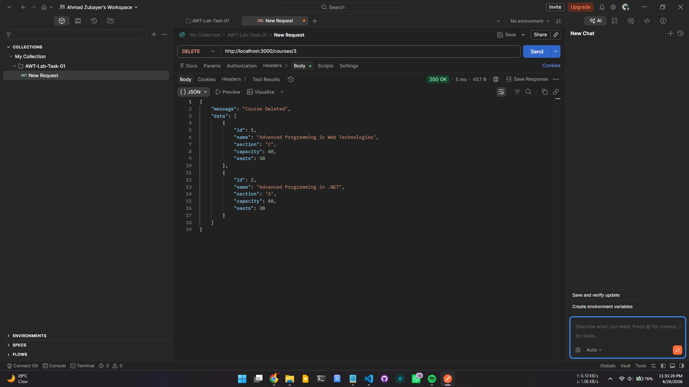

# Lab Task 01

This folder contains the solution of Lab Task 01.

* **Date Completed:** Jume 26. 2026
* **Ahmad Zubayer, ID:** 23-54734-3
* **Section : C** Advanced Programming in Web Technologies 

---

## Scenerio & Requirement:
A Course Management REST API for a university system using NestJS.  
The system will manage basic course operations. All routes must return simple string responses from the Service layer.

---

The api architecture has been implemented in the follwing way:
A course interface has been created.
* `@Controller('courses') CourseController`
* `@Service('courses') CourseService`
* `@Get() getAllCourses() Controller <-> getAllCoursesDb() Service <- precreated courses.db.json file + runtime array`
* `@Get(':id') getCourseById(@Param('id') id: string) Controller <-> getCourseByIdDb(id: number) Service`
* `@Post() createCourse(@Body() course: ICourse) Controller <-> createCourse(course: ICourse) Service`
* `@Put(':id') updateCourseFull(@Param('id') id: string, @Body() course: ICourse) Controller <-> updateCourseFull(id: number, course: ICourse) Service`
* `@Patch(':id') updateCoursePartial(@Param('id') id: string, @Body() course: Partial<ICourse>) Controller <-> updateCoursePartial(id: number, course: Partial<ICourse>) Service`
* `@Delete(':id') deleteCourse(@Param('id') id: string) Controller <-> deleteCourse(id: number) Service`

---

## Testing

### `GET http://localhost:3000/course`

### `GET http://localhost:3000/course/2`

### `POST http://localhost:3000/course`

### `o PUT http://localhost:3000/course/3`

### `o PATCH http://localhost:3000/course/3`

### `o DELETE http://localhost:3000/course/3`

