# Lab Task 02

This folder contains the solution of Lab Task 02.

* **Date Completed:** July 04. 2026
* **Ahmad Zubayer, ID:** 23-54734-3
* **Section : C** Advanced Programming in Web Technologies 

---
## Task:
* Post Data verification using DTO
* File handling using Multer Package

## Testing

## Get All Courses
### `GET http://localhost:3000/courses`
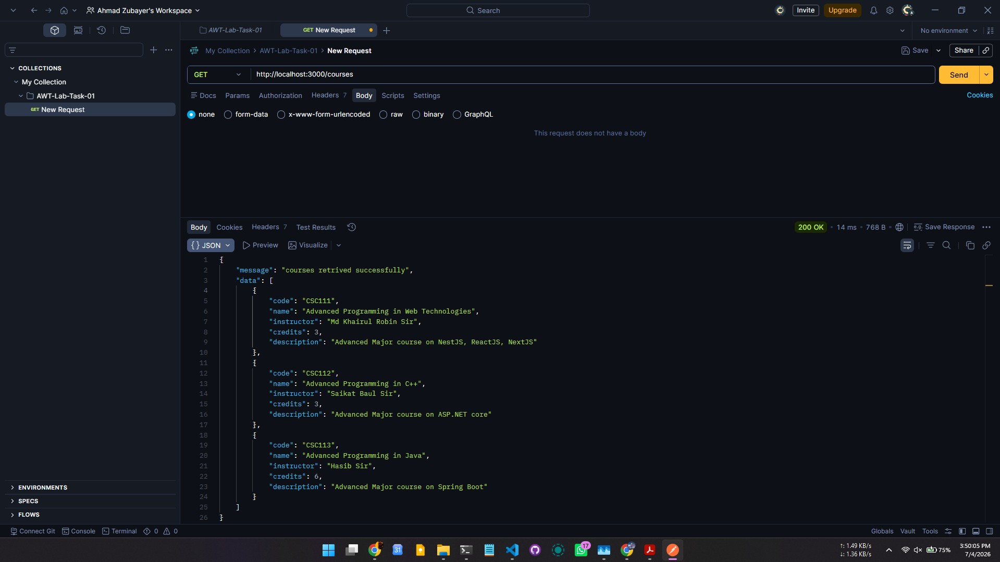

## Get Course By CourseCode
### `GET http://localhost:3000/courses/:code`
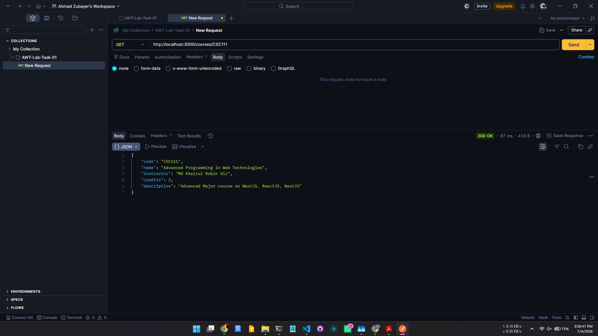

##  Post a Course
### `POST http://localhost:3000/courses`
### Error: Blocked By DTO - "Code" Should be string not number
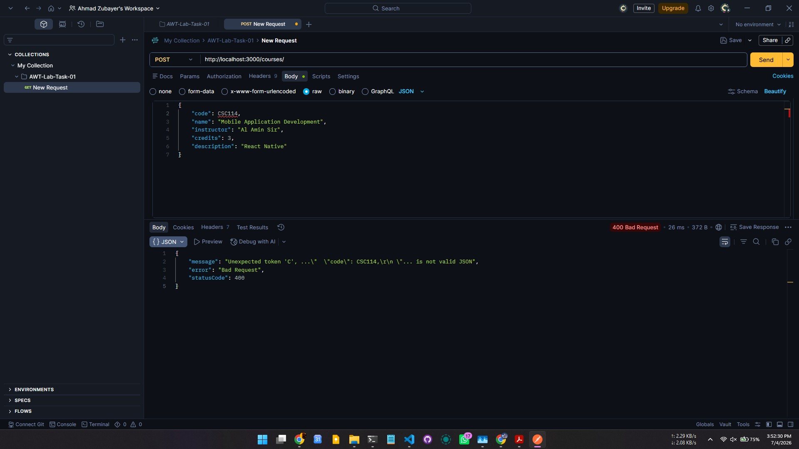

### Error: Blocked By DTO - "Credit" Cannot be empty
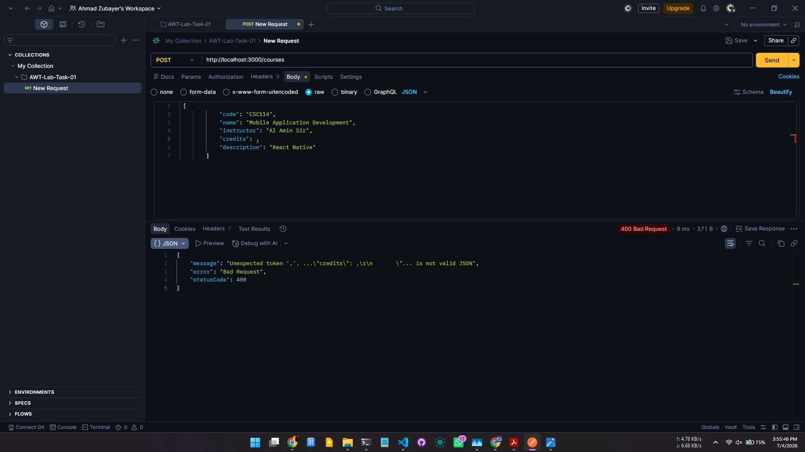

### Course Post Successful (preview in Postman)
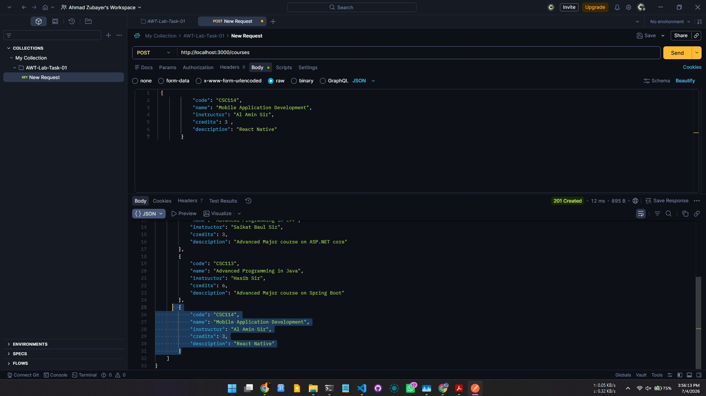

### Course Post Successful (preview in DB JSON File)
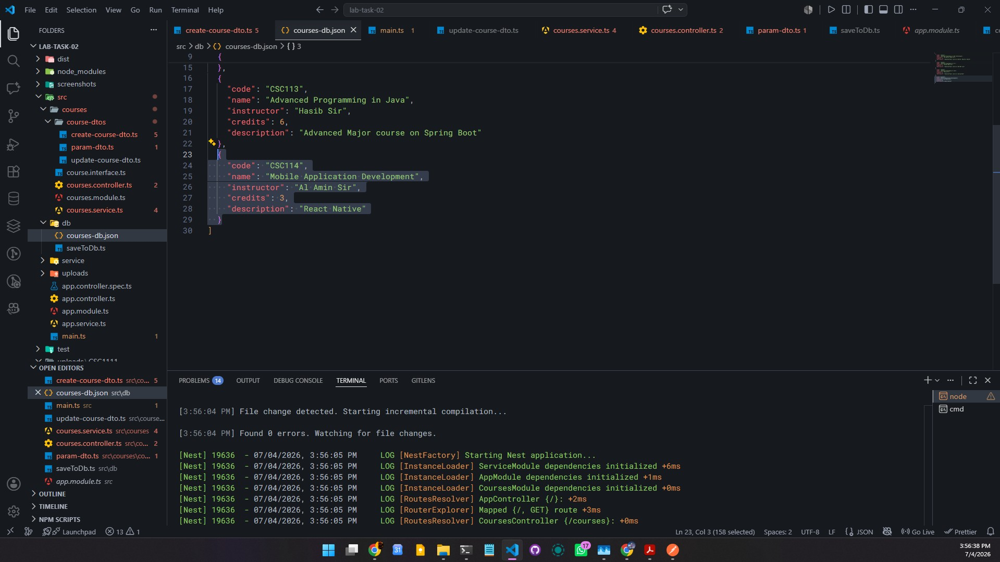

## Patch Course By CourseCode - Partial Update
### `PATCH http://localhost:3000/courses/:code`
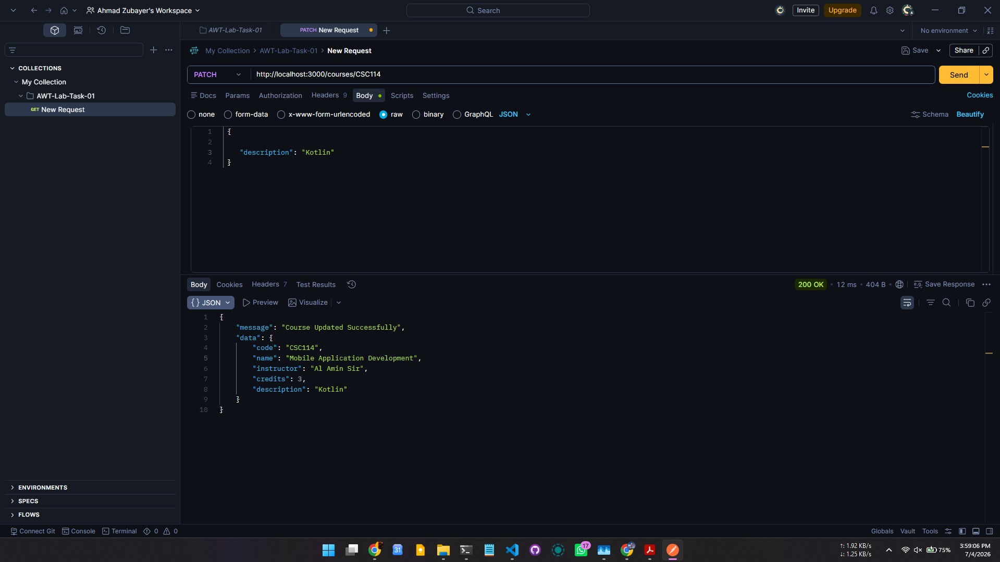

## Put Course By CourseCode 
### `GET http://localhost:3000/courses/:code`
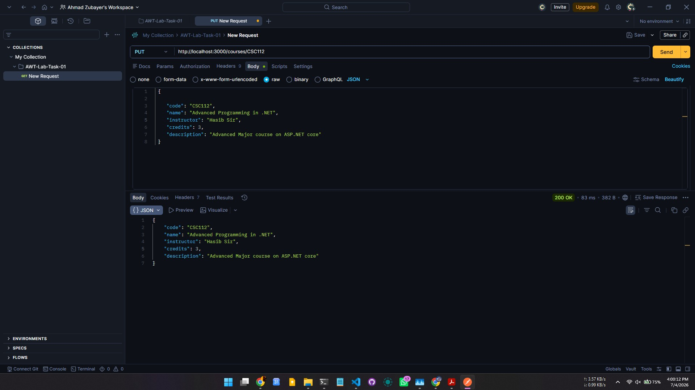

## Delete Course By CourseCode 
### `DELETE http://localhost:3000/courses/:code`
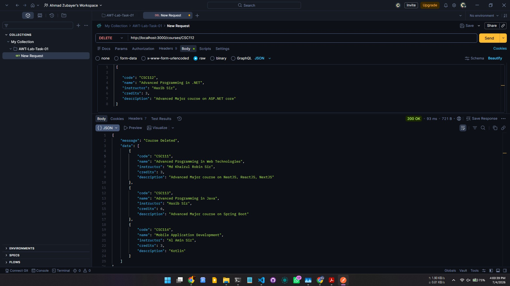

# File Handling Test
### Files are stored in `/uploads/${courseCode}` folder structure, if the courseCode folder does not exists, a folder is created using "mkdir". 
### File Formats Allowed: JPG, JPEG, PDF. Max Size: 10MB

## Upload Material Course By CourseCode 
### `DELETE http://localhost:3000/courses/:code/materials`
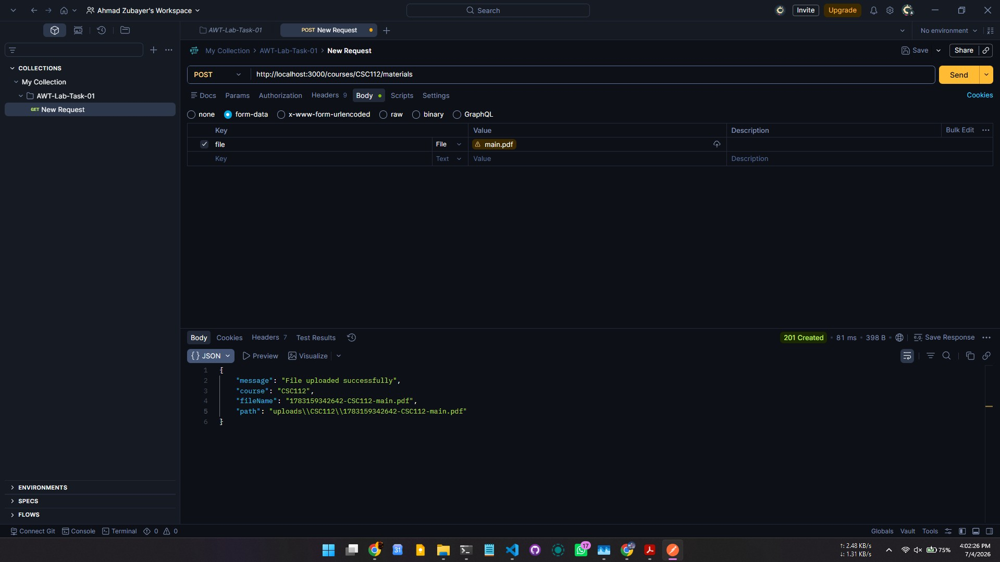
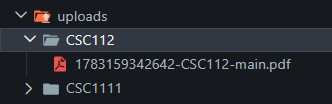

### Error: Blocked By Controller - "EXE" file type not allowed
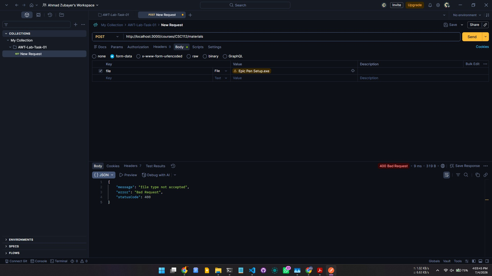

### Error: Blocked By Controller - PDF but more than 10MB not allowed
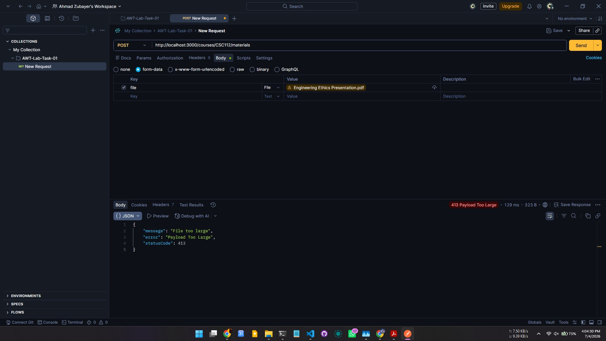

## Download Material Course By CourseCode 
### `GET http://localhost:3000/courses/:code/materials`
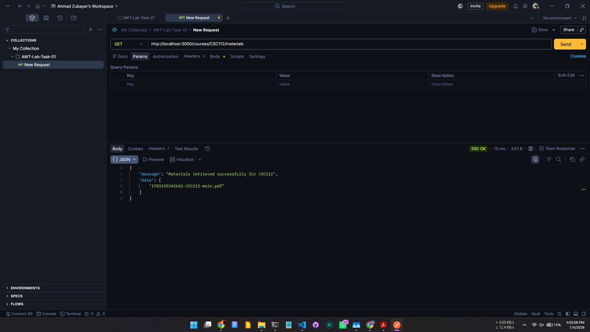

### Error Handled: File Not Uploaded Response if Course Folder not found. 
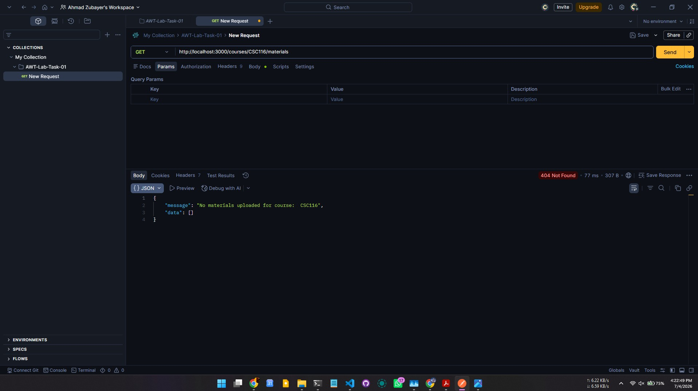
