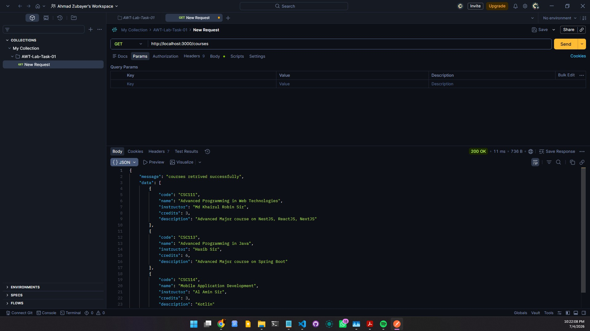
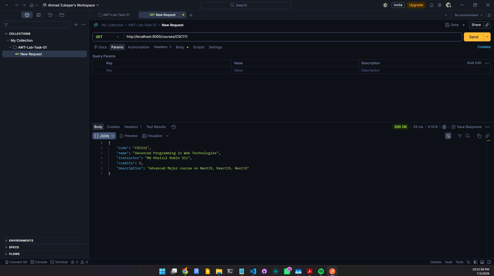
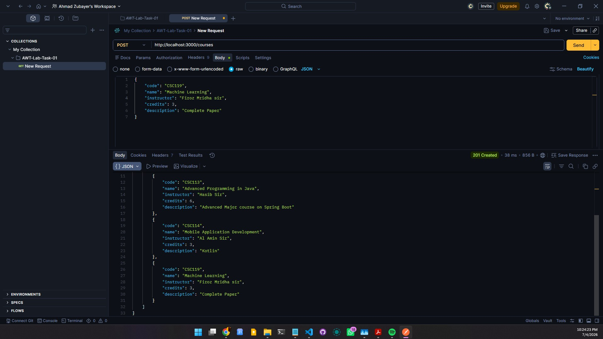
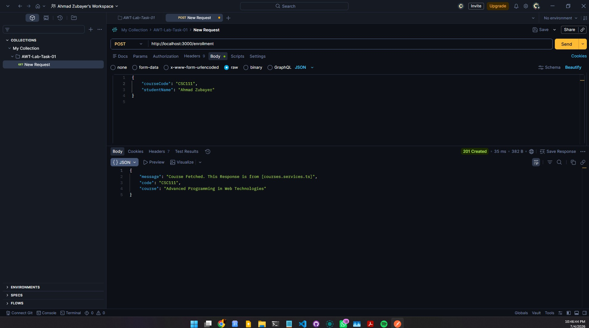
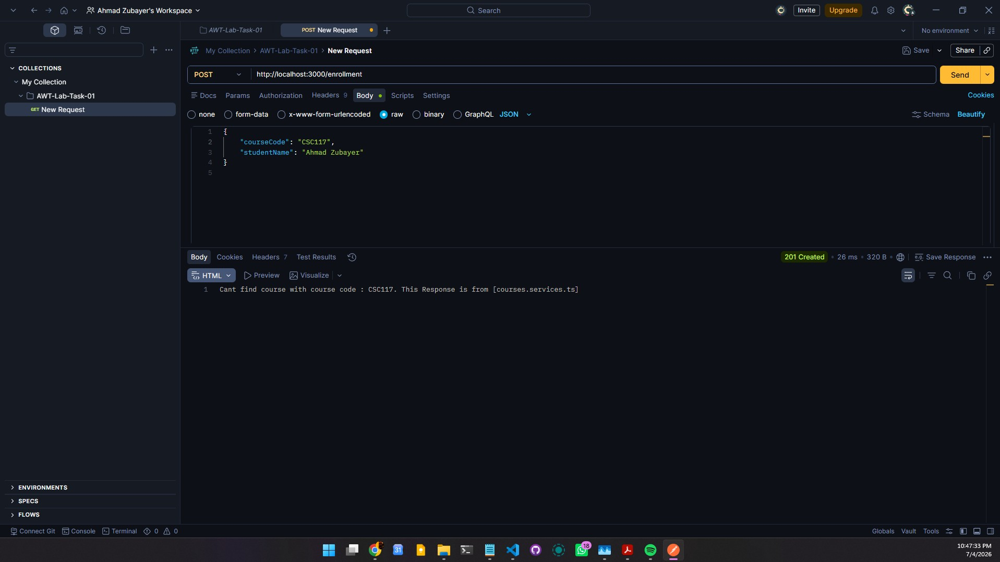
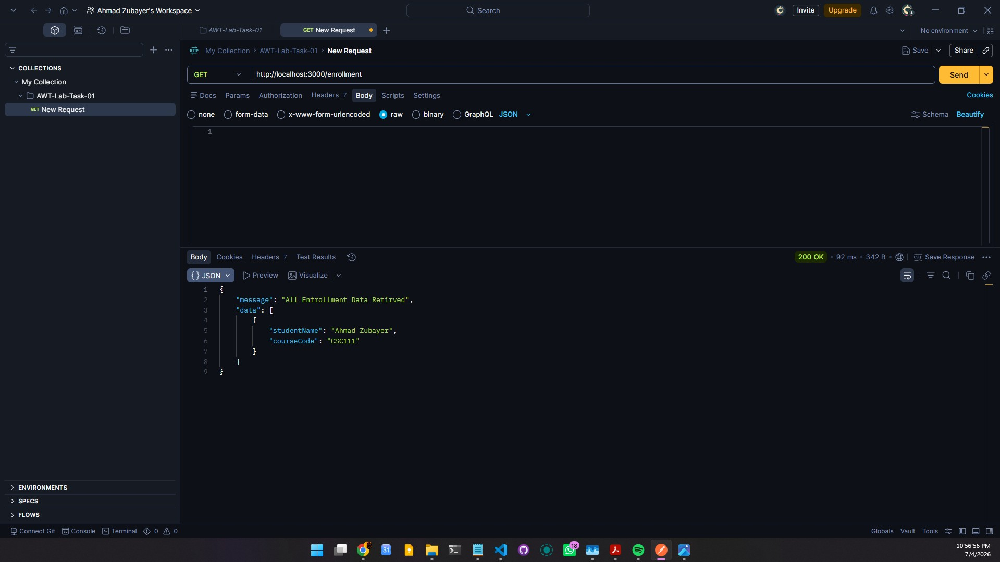
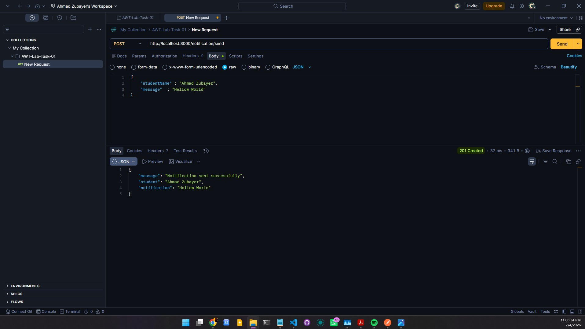
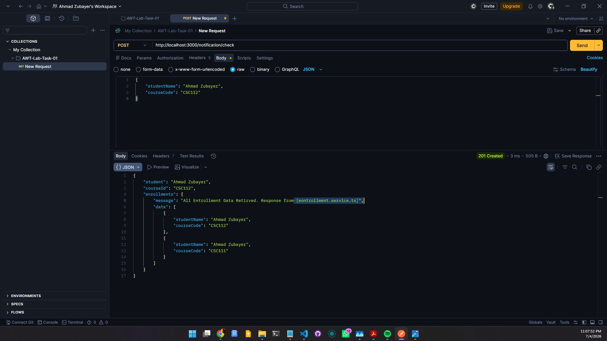
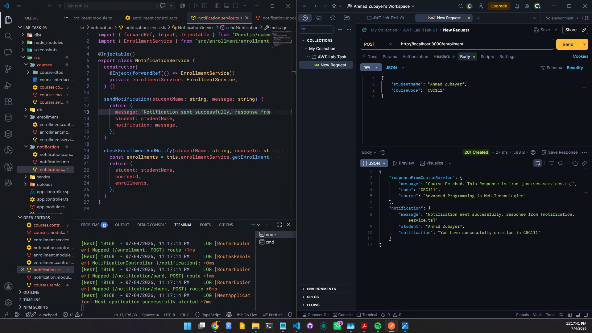

# Lab Task 03

This folder contains the solution of Lab Task 03.

* **Date Completed:** July 04. 2026
* **Ahmad Zubayer, ID:** 23-54734-3
* **Section : C** Advanced Programming in Web Technologies 

---
## Task:
* Dependency Injection
* Intra-Module Dependency Injection : `CoursesService`
* Inter-Module Dependency Injection: `EnrollmentService` -> `CoursesService`
* Circular Dependency: `EnrollmentService` <-> `NotificationService`

## Testing

## 1. Intra-Module (CourseModule):

### 1.1 Get All Courses
### `GET http://localhost:3000/courses`

### 1.2  Get Course By CourseCode
### `GET http://localhost:3000/courses/:code`

### 1.3  Post a Course
### `POST http://localhost:3000/courses`

## 2 Inter-Module (EnrollmentModule uses CourseModule):

### 2.1 Enroll Student: Response includes data from CourseService
### `POST http://localhost:3000/enrollment`

### 2.2 Enrollment Post FAILED, becuase the course code could not be verified by `courses.service.ts`
### `POST http://localhost:3000/enrollment`

### 2.3 Get All Enrollments
### `GET http://localhost:3000/enrollment`

## 3 Circular Dependency (Enrollment + Notification):

### 3.1 Send Notification
### `POST http://localhost:3000/notification/send`

### 3.2 Check Notification
### `POST http://localhost:3000/notification/check`

### 3.3 The response now also includes a notification confirmation from `notification.service.ts` through `entrollment.service.ts`. Also, the app starts without any 'Circular dependency detected' error in the terminal
### `POST http://localhost:3000/enrollment`

