# Lab Task 04

This folder contains the solution of Lab Task 04.

* **Date Completed:** July 05. 2026
* **Ahmad Zubayer, ID:** 23-54734-3
* **Section : C** Advanced Programming in Web Technologies 

---
## Task:
* Single Entity CRUD with TypeORM & PostgreSQL

## Testing

## Create Products Testing
### Database with no table or data

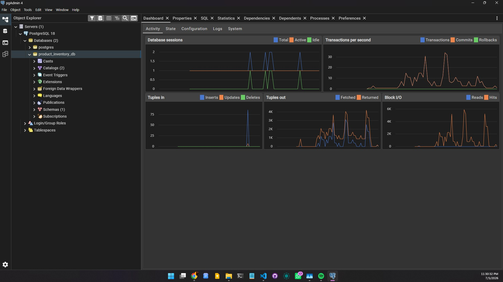

#### `POST /products — Body: { "name": "iPhone 15", "price": 999.99, "stock": 50, "category": "Electronics" }`

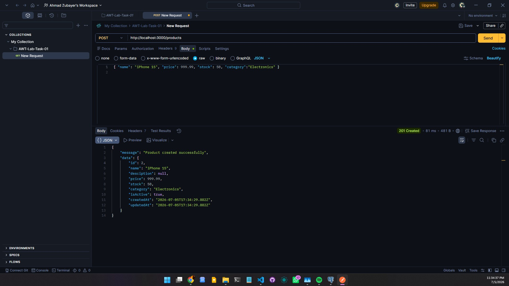

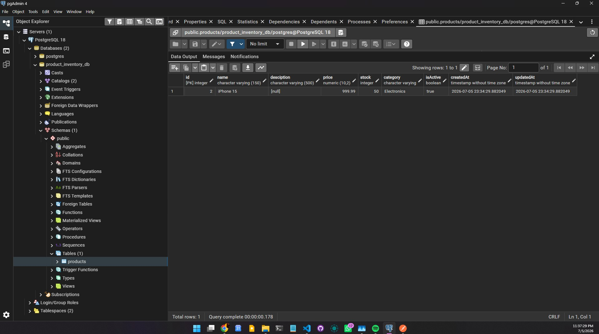

#### `POST /products — Body: { "name": "Samsung TV", "price": 499.99, "stock": 20,"category": "Electronics" }`
#### `POST /products — Body: { "name": "Running Shoes", "price": 89.99, "stock": 100, "category": "Sports" }`
#### `POST /products — Body: { "name": "Notebook", "price": 4.99, "stock": 200, "category":"Stationery" }`

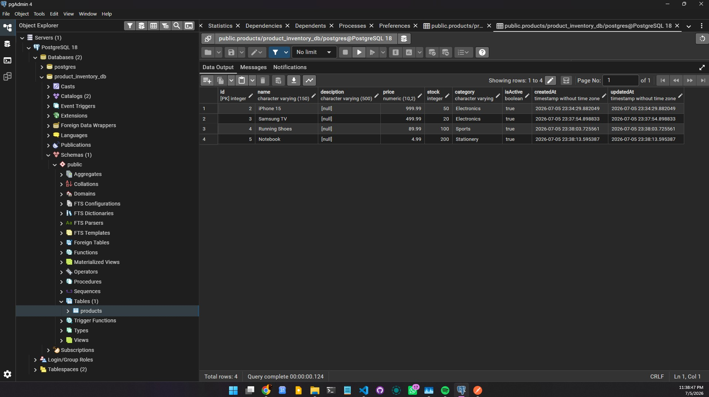

## Read Operations Testing

#### `GET /products` verify all 4 products are returned ordered by newest first

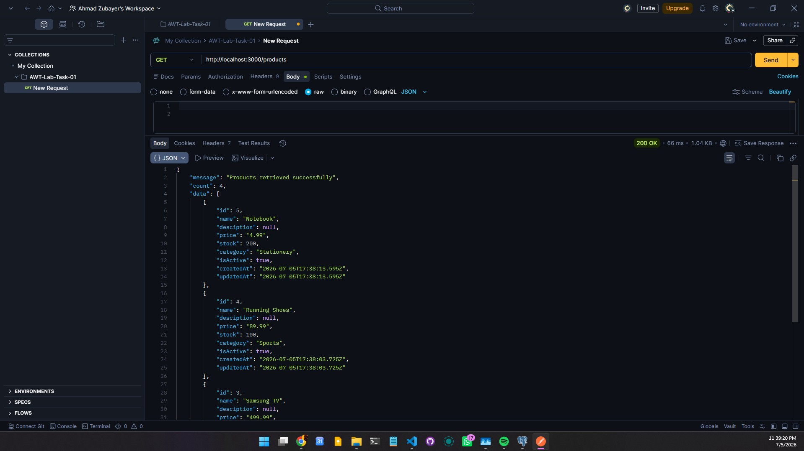

#### `GET /products/2` verify the first product is returned`
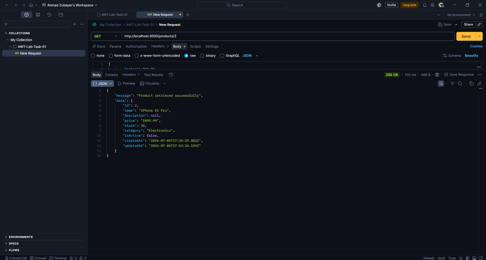

#### `GET /products/999` verify a 404 Not Found error is returned`

#### `GET /products/category/Electronics`  verify only Electronics products are returned
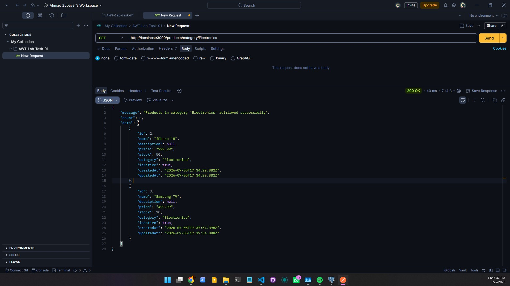

#### `GET /products/search?keyword=phone`  verify iPhone 15 appears in results

#### `GET /products/search?keyword=s`  verify products with 's' in the name are returned
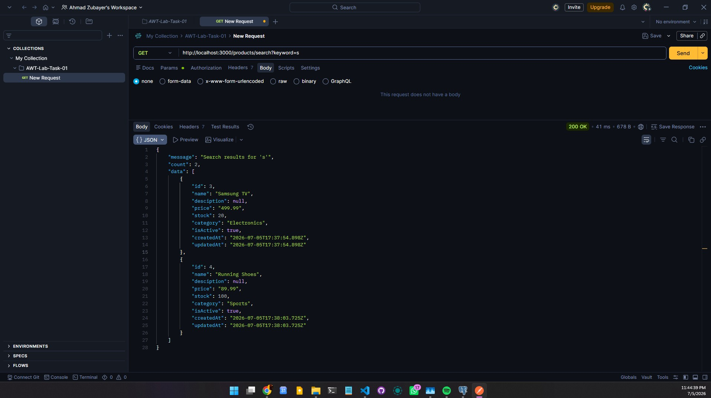

## Update & Toggle test

#### `PATCH /products/1 — Body: { "price": 899.99, "stock": 45 }`  verify only those two fields changed

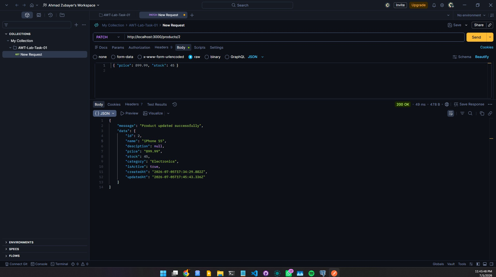

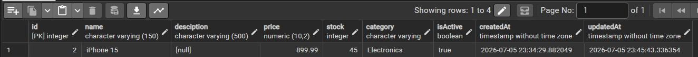

#### `PUT /products/1 — Body: { "name": "iPhone 15 Pro", "price": 1099.99, "stock": 30, "category": "Electronics" }` verify all fields are replaced

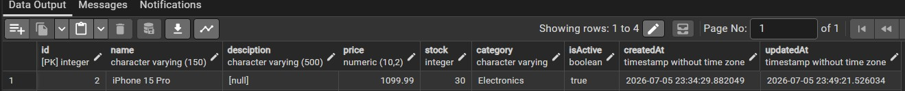

#### `PATCH /products/1/toggle` verified isActive changes from true to false

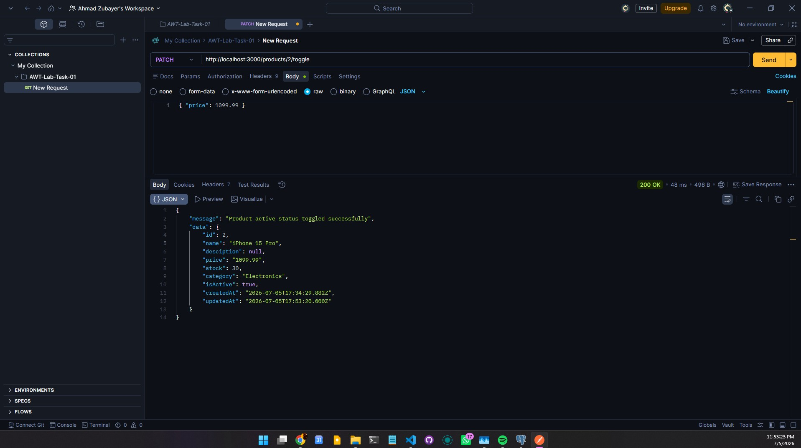

#### `PATCH /products/1/toggle`  verified isActive changes back to true

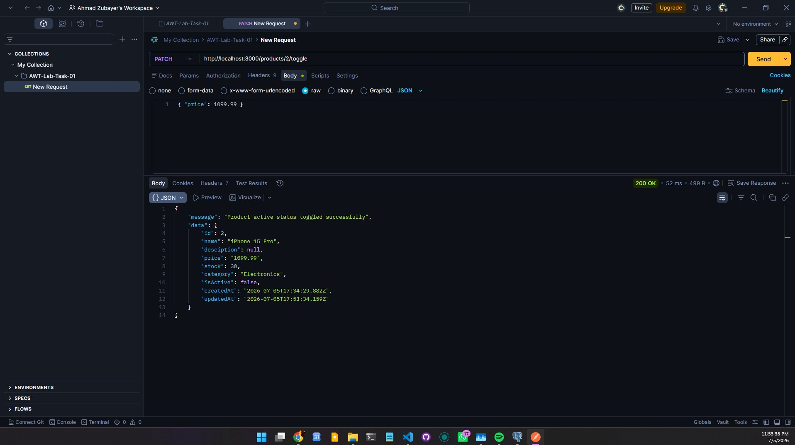

## Database before deletetion testing

## Delete Test

#### `DELETE /products/4`  verified success response with deleted id

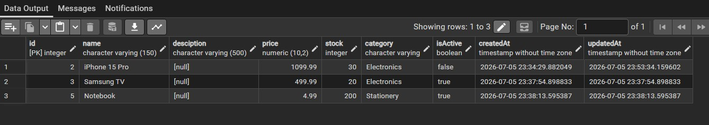

#### `DELETE /products/4`  verify 404 Not Found (already deleted)

#### `GET /products` verify only 3 products remain

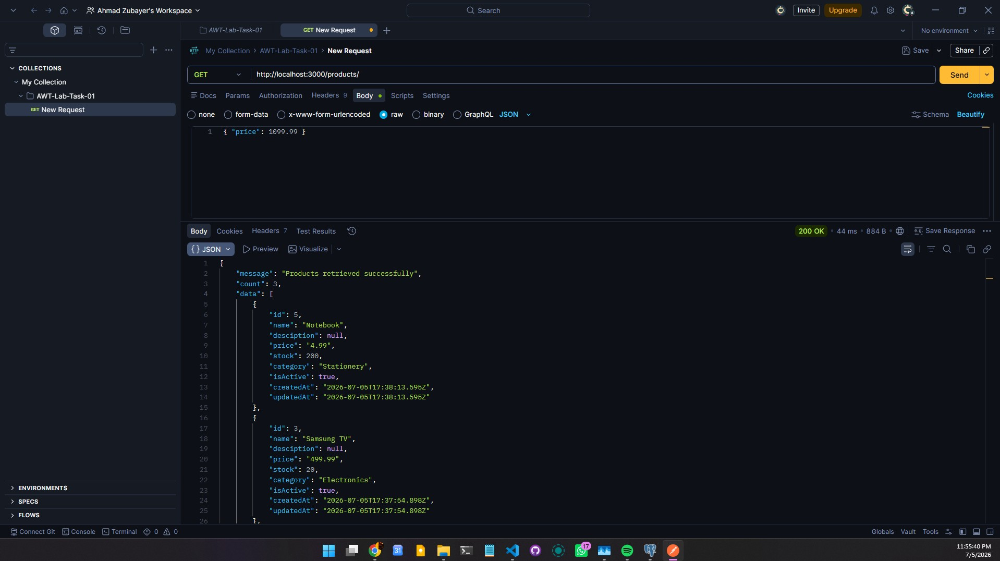

## Validation Errors, DTO Testing 

#### `POST /products with missing name` expect: name should not be empty
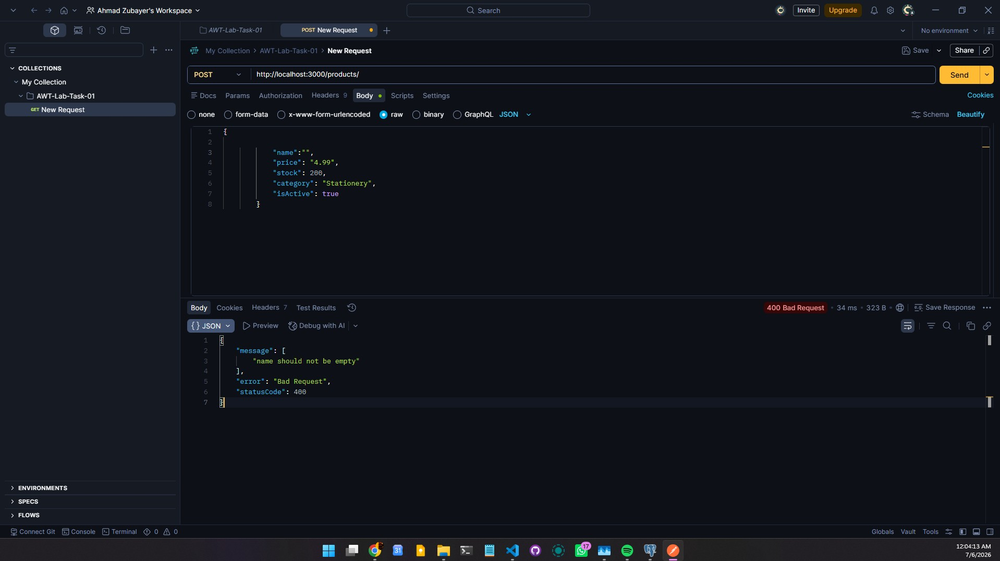

#### `POST /products with price: -5` expect: price must be a positive number
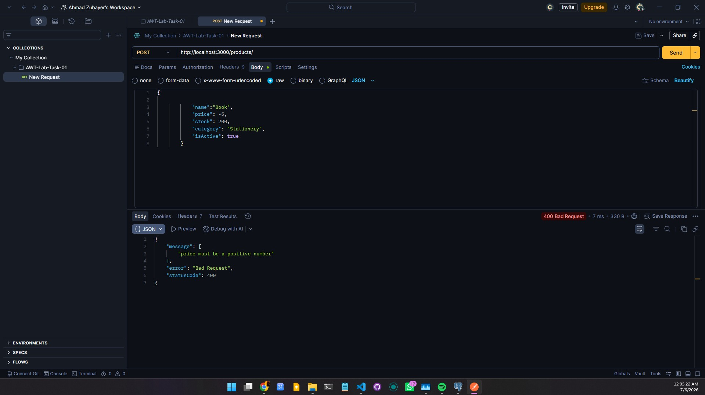

#### `POST /products with extra unknown field` expect: property X should not exist
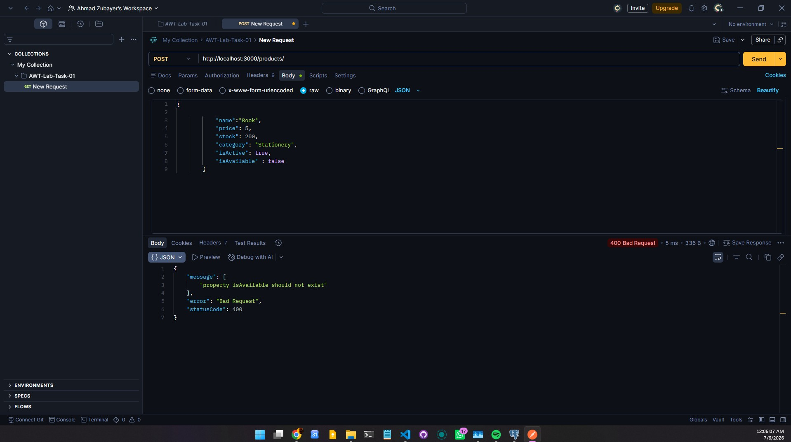

#### `POST /products with no body` expect full list of validation errors
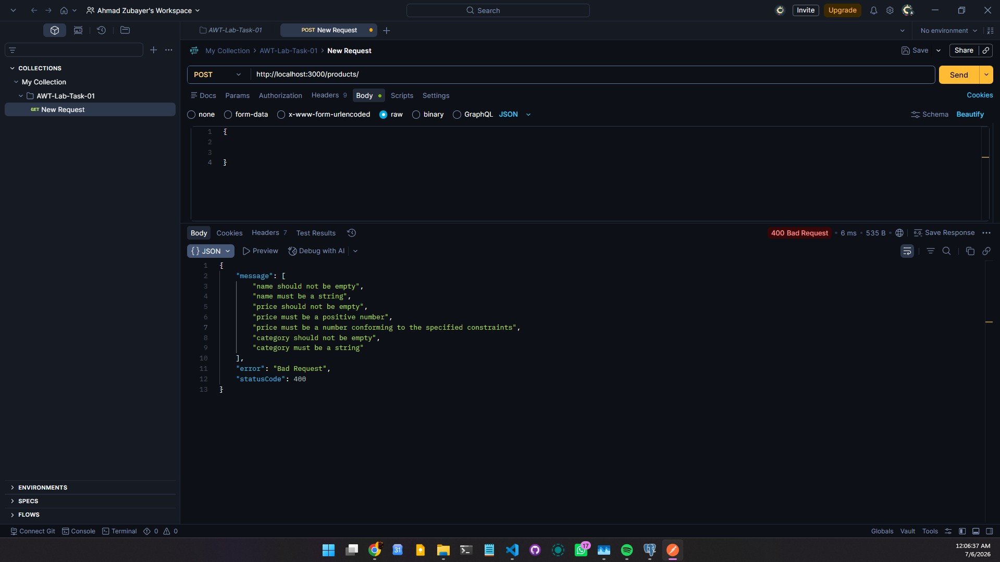

#### `PUT /products/1 — Body: { "price": 799.99 }` verify validation error: name, category are required (all fields must be provided)
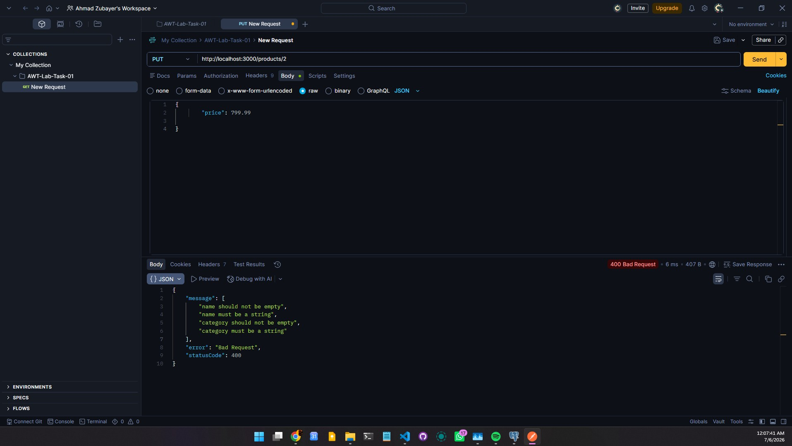

